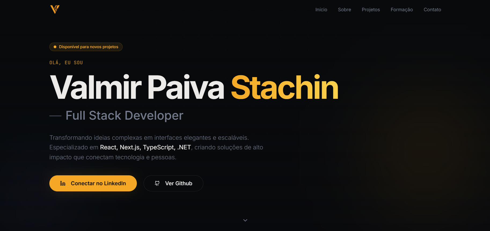

# Portfolio 🎨

Portfólio pessoal desenvolvido para apresentar projetos, experiências e formas de contato de maneira clara e envolvente.

## Visao geral 👀

Este projeto organiza o conteudo do portfólio em secoes modulares e reutilizaveis, com foco em tipografia marcante, transicoes suaves e uma navegacao direta. O objetivo e destacar trabalhos, experiencia e identidade visual de forma consistente.

## Destaques ✨

- 📱 Interface responsiva para diferentes tamanhos de tela.
- 🧩 Componentes reutilizaveis e bem estruturados.
- ✨ Animacoes sutis para melhorar a experiencia.
- 🎯 Design orientado a conteudo, com foco em projetos.

## Stack principal 🛠️

- ⚛️ React
- 🟦 TypeScript
- ⚡ Vite
- 🌬️ Tailwind CSS
- 🧪 Vitest

## Estrutura do projeto 🗂️

- 🧱 [src/components](src/components) com secoes e componentes de interface.
- 🧭 [src/pages](src/pages) com as paginas principais.
- 🧰 [src/lib](src/lib) com utilitarios e animacoes.
- 🪝 [src/hooks](src/hooks) com hooks reutilizaveis.

## Conteudo e identidade 🧠

O texto, as cores e o ritmo das transicoes refletem a identidade do autor. Cada secao foi pensada para contextualizar projetos e habilidades com objetividade e personalidade.
